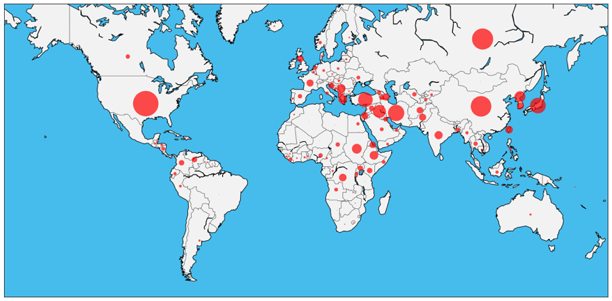

# Predicting the Course of Military Disputes

## Objective
An inter-state military dispute can be thought of as a series of incidents over time. Each incident has some hostility level associated with it, whether the incident be a threat (low hostility level), a blockade, or an attack (high hostility level). The goal of this project was to predict how the hostility level of a dispute would change over time - would it escalate, de-escalate, remain the same, or have no further incidents within 30 days?

## Data
This project uses the following data from the [Correlates of War Project](http://www.correlatesofwar.org/data-sets/folder_listing):

1. COW Country Codes
2. Militarized Inter-state Disputes (v4.1)
  * MID-level data
  * Incident-level data

This project also uses a .csv of latitudes and longitudes for each country, created from this [Google Dataset](https://developers.google.com/public-data/docs/canonical/countries_csv).
